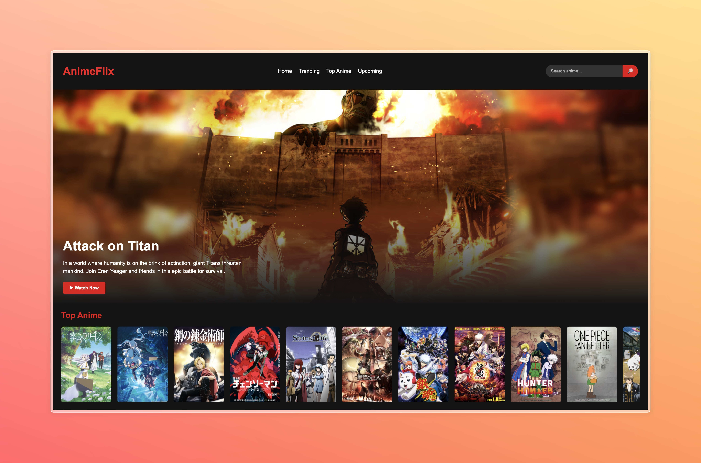
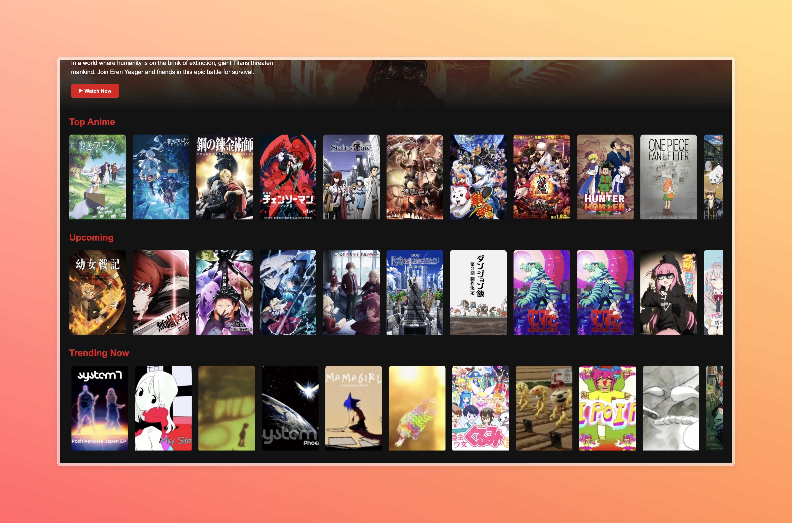
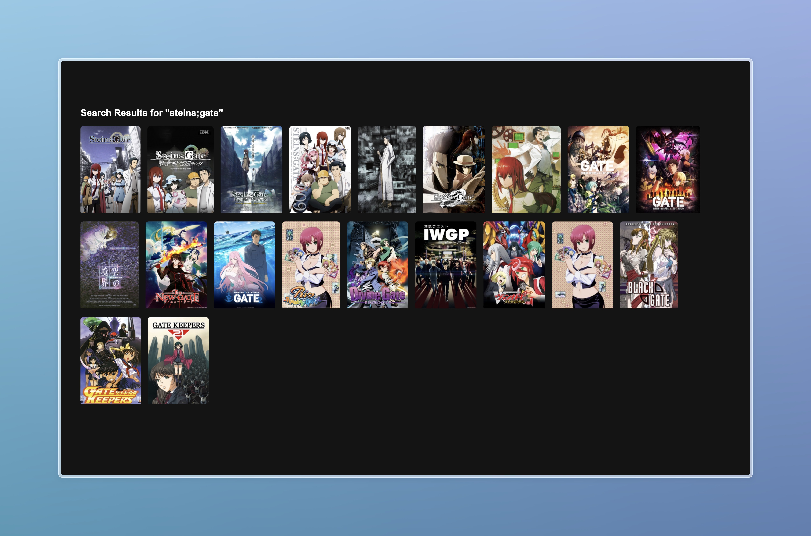

# 🎬 AnimeFlix — Netflix-Inspired Anime Discovery Web App

[](https://anime-flix-sage.vercel.app/)
[](https://react.dev/)
[](https://jikan.moe/)
[]()

**AnimeFlix** is a web application inspired by Netflix, designed for anime enthusiasts.  
Users can browse trending, top, and upcoming anime, search for favorites, and explore detailed anime information using the **Jikan API** (MyAnimeList).

**🌐 Live Demo:** [https://anime-flix-sage.vercel.app/](https://anime-flix-sage.vercel.app/)

---

## 🚀 Key Features

- **Sleek & Modern UI:** Dark-themed design with glassmorphism touches and smooth micro-animations.
- **Dynamic Data Fetching:** Real-time anime data using `axios` and the Jikan API.
- **Search Functionality:** Fully functional search bar with dedicated results page.
- **Horizontal Scrolling Rows:** Netflix-style scrollable rows for different anime categories.
- **Responsive Navigation:** Transparent-to-solid fixed header for smooth scrolling experience.
- **Client-Side Routing:** Powered by `react-router-dom` for SPA navigation.

---

## 📸 Screenshots

### Home Page


> The Home page features a large Hero section showcasing a featured anime (e.g., *Attack on Titan*). Users can browse "Top Anime", "Trending Now", and "Upcoming" rows. Each anime card includes hover overlay effects revealing the title.

### Search Results Page

> Searching via the navbar redirects to the Search page, fetching up to 20 results from the Jikan API, displayed in a responsive grid layout.

---

## 📚 What I Learned

- **React Hooks:** Extensive use of `useState` for state management and `useEffect` for side effects (API calls, URL changes).
- **API Integration:** Fetching and mapping data from RESTful APIs (`axios` + Jikan API) asynchronously with `async/await`.
- **Client-Side Routing:** Using `react-router-dom` (v6+) with `<BrowserRouter>`, `<Routes>`, `<Route>`, and hooks like `useNavigate` and `useLocation`.
- **Modern CSS Techniques:**
  - Fixed, transparent-to-solid navigation bar.
  - Horizontal scroll containers (`overflow-x: auto`) with hidden scrollbars.
  - Gradients blending hero images into dark backgrounds.
  - Interactive hover effects with `transform` and `transition`.

---

## 📅 Version History

### Version 1 (v1) — Foundation 🧱
- Bootstrapped with **Vite** and **React**.
- Static layout including `Navbar`, `Hero`, `AnimeRow`, and `AnimeCard`.
- Used dummy data arrays to verify layout and animations.
- Implemented Netflix-style dark theme, horizontal scroll, and hover zooms.

### Version 2 (v2) — Dynamic Content ⚡
- Replaced dummy data with live data using **Axios** and **Jikan API (V4)**.
- Added SPA routing via **React Router** (`/`, `/anime/:id`, `/search`).
- Implemented search functionality with query routing and dynamic search results.
- Refactored `AnimeRow` component to accept dynamic `url` endpoints (Top, Trending, Upcoming).
- Updated dependencies and resolved port conflicts.

---

## 🛠️ Setup & Installation

1. **Clone the repository:**
```bash
git clone https://github.com/Its-Nahid/animeflix.git
cd animeflix
```

2. **Install dependencies:**

```bash
npm install
```

3. **Start the development server:**

```bash
npm run dev
```

4. Open your browser at `http://localhost:5173` (or the port provided by Vite).

---

## ⚙️ Tech Stack

| Layer      | Technology                                  |
| ---------- | ------------------------------------------- |
| Frontend   | React, Vite, HTML5, CSS3, JavaScript (ES6+) |
| API        | Jikan API (MyAnimeList)                     |
| Routing    | react-router-dom                            |
| Networking | Axios                                       |
| Styling    | CSS3, Glassmorphism, Transitions            |

---

## 👨💻 Author

**Nahid**  
GitHub: [https://github.com/Its-Nahid](https://github.com/Its-Nahid)

⭐ If you find this project useful, consider **starring the repository** to support further development.

---

*Built with React, Vite, CSS, and ❤️*
