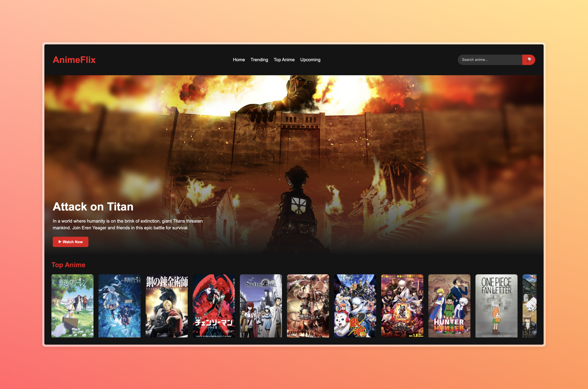
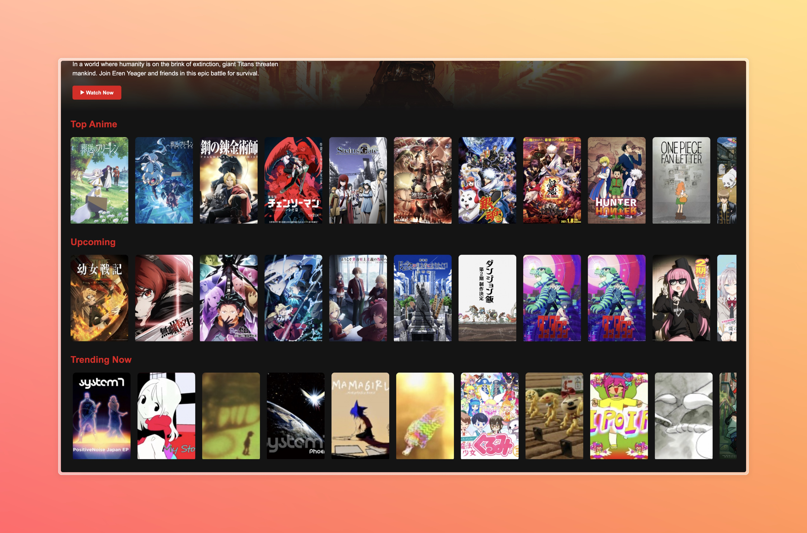
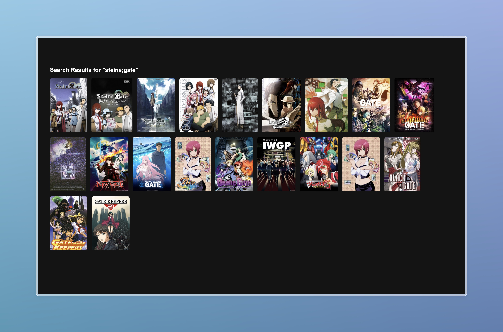

# 🎬 AnimeFlix

> A premium, Netflix-inspired anime streaming & discovery web app.

[](https://anime-flix-sage.vercel.app/)
[](https://react.dev/)
[](https://vitejs.dev/)
[](https://github.com/video-dev/hls.js/)
[](https://anilist.co/)
[]()

**🌐 Live Demo:** [anime-flix-sage.vercel.app](https://anime-flix-sage.vercel.app/)

---

## ✨ Features

### 🏠 Home & Discovery
- **Hero Carousel** — Auto-rotating slideshow of seasonal highlights with official anime logos, custom backdrop art, and smooth crossfade transitions.
- **Content Rows** — Netflix-style horizontally scrollable rows for Latest Episodes, Seasonal Highlights, All-Time Popular, Top Rated, and Highly Anticipated Upcoming anime.
- **Anime Cards** — Rich hover interactions displaying title, score, episode count, format, and status.

### 🔍 Search
- **Real-Time Search** — Full-text search powered by AniList GraphQL with instant results.
- **Advanced Filtering** — Sort by popularity, score, trending, or seasonal relevance.
- **Responsive Grid** — Clean card-based results layout with quick navigation to details.

### 📖 Anime Details
- **Rich Info Page** — Synopsis, genres, studios, airing status, episode count, score, and cover art.
- **Episode Browser** — Scrollable episode list with TVDB thumbnails and titles (via Zenshin API).
- **Tabbed Navigation** — Switch between Episodes view and additional info.
- **Seasons & Relations** — Navigate between related anime and sequels.

### ▶️ Video Player
- **Custom Control Bar** — A clean, modern player UI inspired by YouTube/Netflix. A gradient bottom bar (auto-hiding after inactivity) holds play/pause, ±10s skip, hover-expand volume, a click-to-seek scrubber with buffered progress, and a live time display. The video frame stays uncluttered — no floating overlays.
- **HLS Streaming** — Adaptive bitrate video playback via HLS.js with AES-128-CBC decryption handled server-side.
- **Settings Menu** — Nested popover for **Quality** (Auto / 1080p / 720p / 480p / 360p via real-time HLS level control), **Playback Speed** (0.5x–2x), and **Server** selection (Auto, Kite, Dio).
- **Subtitles / CC** — Toggle and switch between available subtitle tracks.
- **SUB / DUB Toggle** — Switch between subbed and dubbed audio tracks where available.
- **Fullscreen & Shortcuts** — Click-to-play, double-click for fullscreen, and a dedicated fullscreen toggle.
- **3-Column Layout** — Video player + episode list sidebar + related anime recommendations.

### 🎨 Design
- **Dark Theme** — Premium dark UI with glassmorphism effects, gradients, and subtle micro-animations.
- **Shimmer Loading** — Skeleton placeholders across all pages for a polished loading experience.
- **Fully Responsive** — Optimized for desktop, tablet, and mobile viewports.

---

## 🏗️ Architecture

```
┌───────────────┐     ┌──────────────────┐     ┌────────────────────┐
│   React SPA   │────▶│  Proxy Server    │────▶│  Animetsu API      │
│  (Vite :5173) │     │  (Node.js :8080) │     │  (upstream)        │
└───────────────┘     └──────────────────┘     └────────────────────┘
        │                      │
        │                      ├──▶ AniList GraphQL (metadata, cached + rate-limit safe)
        │                      ├──▶ HLS Playlist Rewriting
        │                      └──▶ AES-128 Key Proxy & Decryption
        │
        └──▶ Zenshin API (episode thumbnails & titles)
```

### Proxy Server (`proxy.cjs`)

The Node.js proxy is a critical piece of the architecture. It handles:

| Responsibility | Description |
|---|---|
| **CORS Bypass** | Adds proper CORS headers so the browser can talk to upstream APIs |
| **AniList → Animetsu ID Mapping** | Translates AniList numeric IDs to upstream internal IDs via title-based search |
| **AniList Enrichment Cache** | Persists relations/characters/staff/recommendations to `anilist_cache.json`, building a local store so repeat visits rarely re-hit AniList |
| **Rate-Limit Resilience** | Detects AniList `429/503` responses, enters a cooldown (honoring `Retry-After`), and serves stale/empty data so the rest of the app keeps working |
| **HLS Playlist Rewriting** | Rewrites `.m3u8` playlists to route segment and key URLs through the proxy |
| **AES-128 Key Proxying** | Fetches and caches encryption keys for HLS segment decryption |
| **Image Proxying** | Routes Cloudflare-protected episode thumbnails through the server |

---

## 🛠️ Tech Stack

| Layer | Technology |
|---|---|
| **Frontend** | React 18, Vite 5, JavaScript (ES6+) |
| **Styling** | Vanilla CSS3, Glassmorphism, CSS Transitions & Animations |
| **Routing** | React Router v7 |
| **HTTP** | Axios |
| **Streaming** | HLS.js (adaptive bitrate, quality switching) |
| **Backend** | Node.js proxy server (`proxy.cjs`) |
| **APIs** | AniList GraphQL, Animetsu, Zenshin API |
| **Deployment** | Vercel (frontend) |

---

## 📁 Project Structure

```
AnimeFlix/
├── proxy.cjs                # Node.js CORS proxy & HLS rewriter
├── index.html               # Entry HTML
├── package.json
├── vite.config.js
├── public/
│   └── *.jpeg               # Screenshots
└── src/
    ├── main.jsx              # React entry point
    ├── App.jsx               # Router setup
    ├── config.js             # API endpoints & helpers
    ├── index.css             # Global styles & design system
    ├── custom.css            # Component-specific styles
    ├── components/
    │   ├── Navbar.jsx        # Fixed navigation bar
    │   ├── hero.jsx          # Hero carousel with custom logos/banners
    │   ├── AnimeRow.jsx      # Horizontal scrollable content row
    │   ├── AnimeCard.jsx     # Interactive anime card with hover effects
    │   ├── SearchBar.jsx     # Search input component
    │   ├── Sidebar.jsx       # Navigation sidebar
    │   └── Footer.jsx        # Site footer
    └── pages/
        ├── Home.jsx          # Landing page with hero + rows
        ├── AnimeDetails.jsx  # Anime info + episode browser
        ├── WatchPage.jsx     # Video player + episode sidebar
        ├── Search.jsx        # Search results page
        └── Recent.jsx        # Recently updated episodes
```

---

## 🚀 Getting Started

### Prerequisites

- **Node.js** v18+ and **npm**

### Installation

```bash
# Clone the repository
git clone https://github.com/Its-Nahid/AnimeFlix.git
cd AnimeFlix

# Install dependencies
npm install
```

### Running Locally

You need **two terminals** running simultaneously:

```bash
# Terminal 1 — Start the API proxy server
node proxy.cjs
```

```bash
# Terminal 2 — Start the Vite dev server
npm run dev
```

Then open **http://localhost:5173** in your browser.

> **Note:** Both the proxy server (`:8080`) and the Vite dev server (`:5173`) must be running for the app to function. See [TROUBLESHOOTING.md](./TROUBLESHOOTING.md) if you run into port conflicts or connection issues.

### Environment Variables (Optional)

| Variable | Default | Description |
|---|---|---|
| `PORT` | `8080` | Proxy server port |
| `VITE_API_BASE_URL` | `http://localhost:8080` | API base URL used by the frontend |

---

## 📸 Screenshots

### Home Page


> Hero carousel showcasing seasonal anime with official logos and custom wallpaper backgrounds. Netflix-style content rows below.

### Search Results

> Full-text search with responsive grid layout and rich anime cards.

---

## 📅 Version History

### v4 — Player Redesign & Resilience 🎛️
- Rebuilt the **video player controls** from scratch — a modern, auto-hiding bottom control bar (scrubber, play/pause, skip, volume, time, subtitles, settings, fullscreen) replacing the old floating overlays. The video frame is now clean.
- Moved **Quality / Speed / Server** into a nested settings popover and added **playback speed** control.
- Made AniList enrichment **rate-limit resilient**: responses are cached to `anilist_cache.json` (survives restarts), and `429/503` responses trigger a cooldown so the app keeps working even when AniList is unavailable.

### v3 — Streaming & Polish 🎥
- Integrated **HLS.js** for adaptive bitrate video streaming with AES-128 decryption.
- Added **HLS quality selector** for manual resolution switching.
- Built a **3-column WatchPage** layout (player + episodes + recommendations).
- Added **SUB/DUB toggle** and **multi-server** selection.
- Implemented **hero carousel** with auto-rotation, official anime logos (`LOGO_MAP`), and custom backdrop images (`BANNER_MAP`).
- Created **proxy server** (`proxy.cjs`) handling CORS, HLS rewriting, AniList→Animetsu ID mapping, and image proxying.
- Integrated **Zenshin API** for episode thumbnails and titles.
- Added **seasons/relations** navigation bar on the watch page.

### v2 — Dynamic Content ⚡
- Replaced dummy data with live data using **Axios** and **Jikan API (v4)**.
- Added SPA routing via **React Router** (`/`, `/anime/:id`, `/search`).
- Implemented search functionality with query routing and dynamic results.
- Refactored `AnimeRow` to accept dynamic API endpoints.

### v1 — Foundation 🧱
- Bootstrapped with **Vite** and **React**.
- Static layout with `Navbar`, `Hero`, `AnimeRow`, and `AnimeCard`.
- Netflix-style dark theme, horizontal scrolling, and hover animations.

---

## 🤝 Contributing

Contributions are welcome! Feel free to open issues or submit pull requests.

---

## 👨‍💻 Author

**Nahid**
GitHub: [Its-Nahid](https://github.com/Its-Nahid)

⭐ If you enjoy this project, consider **starring the repo** — it helps a lot!

---

*Built with React, Vite, HLS.js, and ❤️*
